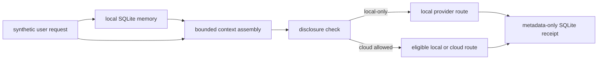

# Coral: local-first AI orchestration prototype

Coral is a local-first AI orchestration prototype for coordinating durable memory, bounded context, privacy-aware model routing, and operational audit receipts. This clean-room portfolio edition makes those controls visible in a small, inspectable Python implementation backed by SQLite.

## Why this project matters

AI features become operational systems when they handle state, privacy, and failure boundaries as deliberately as they handle prompts. Coral makes those boundaries visible. A memory is stored locally; the context builder limits what enters a model request; a disclosure policy filters eligible providers; and a durable receipt records what route was selected without storing prompt content.

This edition is a focused portfolio demonstration, not the full Coral system. Its provider definitions are illustrative route records: **the demo does not call a model or send data over a network**.

## What I built

- A SQLite-backed memory and operation-receipt store.
- A deterministic, character-bounded context assembler.
- A disclosure gate that treats unknown classifications as local-only.
- A local/cloud routing decision that only considers eligible providers.
- A small runnable workflow and tests built entirely on fictional data.

The design is intentionally small enough for a hiring manager to follow from the README through the code, while showing practical implementation choices around AI operations and privacy.

## Architecture



The sequence is memory retrieval → context assembly → disclosure evaluation → eligible provider selection → receipt persistence. Context text is held in memory for the demonstration. Receipts store digests and source references, not prompt or response bodies.

## Install and run

Requires Python 3.11 or newer. The implementation uses only the Python standard library. Install the local package in editable mode:

```bash
python -m venv .venv
source .venv/bin/activate
python -m pip install -e .
coral-demo
```

The `coral-demo` command writes `.coral-local/coral-demo.db` under the current directory. That path is ignored by Git. It prints route metadata and a receipt ID, not the assembled prompt. Set `CORAL_DEMO_DISCLOSURE=local_only` to see the local-only route. `CORAL_PREFERRED_PROVIDER` accepts `local` or `cloud`; `CORAL_CONTEXT_BUDGET_CHARS` sets a positive context character limit.

On PowerShell:

```powershell
python -m venv .venv
.\.venv\Scripts\Activate.ps1
python -m pip install -e .
$env:CORAL_DEMO_DISCLOSURE = "local_only"
coral-demo
```

## Example output

With the synthetic request marked `local_only`, the routing-only demo reports:

```text
Disclosure: local_only
Selected route: local (local-demo)
Decision: allowed — local fallback
SQLite receipt ID: 1
```

The receipt stores route metadata and a context digest; it does not store or print context text.

## Run the tests

```bash
python -m unittest discover -s tests -v
```

Tests use temporary SQLite databases and synthetic records. They do not use personal, customer, or company data, and make no network calls. The `.env.example` file documents optional settings; the demo reads exported environment variables and does not parse `.env` files.

## Privacy and security decisions

- Memory and receipts are persisted locally in SQLite.
- Unknown disclosure labels fail closed to local-only.
- Local-only context cannot route to a remote provider.
- The example stores a context digest in receipts, not the request, memory, or model output.
- Provider entries are metadata only; no credentials or live model clients are included.
- `.env` files, databases, logs, local state, and common key files are ignored.

This is an educational sample, not a security certification. Production use would need authenticated provider adapters, operational key management, access controls, retention policy, migration strategy, and threat-model review.

## Repository map

```text
src/coral_portfolio/   Small, clean-room implementation
docs/                  Architecture notes and source-review boundary
diagrams/              Mermaid system diagram
examples/              Synthetic end-to-end scenario
tests/                 Standard-library tests using temporary databases
```

## Source and scope

This repository was created with fresh Git history and no inherited development history. The implementation is a new, narrow portfolio sample informed by selected design concepts from Coral Core; it does not include private identity/persona material, production databases, research artifacts, avatar assets, mobile integrations, or one-off operational scripts. See [`docs/source-review.md`](docs/source-review.md) for the file-by-file boundary.
