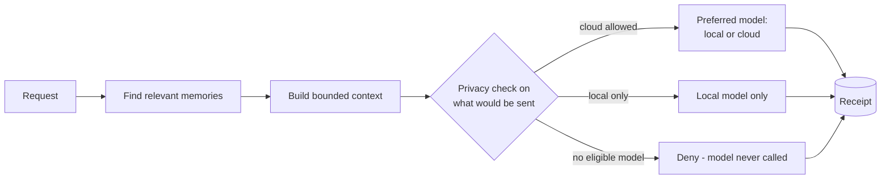

# Coral

**A private AI layer that decides what any model is allowed to see, and keeps a record of what happened.**

`Status: public slice of a personal system I'm actively building · Python · SQLite · Ollama · 14 tests`

---

## Why I built this

I came to AI from operations. I've built inventory, QC, and traveler systems on a manufacturing floor, and those systems taught me to ask the same few questions about any process: *What's allowed to move? Who's allowed to act? What happens when something is uncertain? Can I reconstruct what happened afterward?*

Coral started as a personal problem. My first attempt was a productivity app. It worked, but it had too much friction, and I stopped using it. What I *kept* using was an AI assistant with memory. But I didn't love handing a cloud provider my whole life, and I didn't want my memory, context, and workflows locked to one company's product.

So Coral flips the relationship: **models are replaceable; the memory and the rules stay mine.** Most work runs on a local model. Cloud models are used only when the information involved is allowed to leave the machine. Every decision leaves a receipt.

This repository is a small, runnable slice of that idea using fictional data. My private development version holds real memory and includes experiments with bounded agent and tool execution. Real memory doesn't belong on a public GitHub, and the agent work isn't finished.

## See it work

Four fictional memories about a team. One is marked private, and one was never labeled at all. Watch what happens to three different questions:

```text
$ coral-demo --prefer cloud --ask "Who supplies our packaging?"
Memories:    memory:2
Disclosure:  cloud_allowed
Route:       remote (cloud-example, model cloud-model-placeholder)
                                    # ^ public info: the preferred cloud route is allowed

$ coral-demo --prefer cloud --ask "Is the team lead negotiating a raise?"
Memories:    memory:3
Disclosure:  local_only
Route:       local (local-mock, model mock)
                                    # ^ a private memory got pulled in, so it stays local
Answer:      Based on what I have stored: The example team lead is negotiating a raise and wants that kept private.

$ coral-demo --no-local --ask "Is the team lead negotiating a raise?"
Disclosure:  local_only
Route:       none
Decision:    DENIED - no provider is eligible for local_only content
```

That last one matters most. When the local model is unavailable, Coral **refuses** instead of quietly falling back to the cloud, and it still writes a receipt saying it refused:

```json
{
  "decision": "denied",
  "reason": "no provider is eligible for local_only content",
  "disclosure": "local_only",
  "provider_id": null,
  "source_refs_json": "[\"memory:3\"]",
  "context_sha256": "6be06e07...",
  "policy_version": "disclosure-v2"
}
```

The receipt says *which* memory was involved and *what* was decided, but none of the private text. You can audit the system without the audit log becoming a second copy of everything sensitive.

## How it works



## The decisions behind it

| Decision | Why |
|---|---|
| **Privacy is judged on what's actually sent, not on the question.** | An innocent-looking question can pull in a private memory. The strictest label among the retrieved memories wins. |
| **Unlabeled means private.** | If nobody decided whether something can leave the machine, the safe answer is no. On a production floor, an unverified part doesn't ship. |
| **Denials get receipts too.** | "What did the system refuse to do?" is often the most important audit question. |
| **Only send what's relevant.** | Privacy isn't just local vs. cloud. It's also "what's the minimum this model needs?" Retrieval keeps weak matches out of the context entirely. |
| **Whole memories or nothing.** | When the context budget is tight, memories are dropped rather than cut in half. Half a fact can be worse than no fact. |
| **Simple, explainable retrieval.** | Keyword scoring that favors rare words. I can explain exactly why a memory was chosen. No vector database added just to look sophisticated. |
| **Models plug in behind one interface.** | Swapping Ollama for another provider means writing one small class. The memory and receipts don't change. |

## Run it

Python 3.11+, no dependencies.

```bash
python -m pip install -e .
coral-demo                       # works offline with a built-in mock model
python -m unittest discover -s tests -v
```

With a real local model ([Ollama](https://ollama.com)):

```bash
ollama pull qwen2.5:3b
coral-demo --ollama --model qwen2.5:3b --ask "When is the quarterly review?"
```

The Ollama client is covered by tests that mock the server. CI doesn't run a live model.

Other flags: `--prefer local|cloud`, `--no-local` (simulate the local model being offline), `--disclosure`, `--budget`. Each run starts from the same fictional data.

## What's public and what isn't

| In this repo | In my private Coral |
|---|---|
| Retrieval, privacy routing, denial, receipts, optional local model | All of that, plus persistent personal memory, manual corrections that take precedence over derived memory, and stored conversation history behind a local CLI |
| Fictional memories | Real memory |
| One cloud route, defined but not connected | Experiments with several local and cloud models as cost/capability tiers |
| — | A prototype permission layer for AI agents that can take real actions: tasks get bounded permissions, unknown actions are denied by default, and nothing downstream can grant itself more authority than it was given |

The cloud route here is a placeholder on purpose: the demo never sends anything over the internet.

**This is not a security product.** A production version would need authenticated providers, key management, access control, retention rules, and a proper threat review.

---

Built by [Michael Perry](https://perry.is). I design the system, specify the behavior and tests, and direct AI coding agents to implement it, then review and verify the result with a second model. [More of my work →](https://github.com/perry-is)
